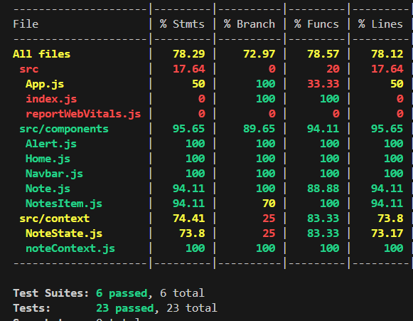

# Task Management Application

## Introduction

The Task Management application is a web-based tool that allows users to manage their tasks efficiently. Users can create, update, delete, and filter tasks based on their status.

## Screenshots


## Technologies
- **Frontend**: The frontend of this application is built using React.js.
- **Backend**: The backend is developed with Node.js and MongoDB.
- **Unit Testing & Coverage**: For unit testing and code coverage, we use Jest and Mocha.

## Features

- Create new tasks
- Update existing tasks
- Delete tasks
- Filter tasks based on status
- Search tasks based on title

## Setup the Application

### Prerequisites

- Node.js (v14 or higher) - [Download](https://nodejs.org/en/download/source-code)
- MongoDB - [Download](https://fastdl.mongodb.org/windows/mongodb-windows-x86_64-8.0.3-signed.msi)

### Installation

1. **Clone the repository :**
 Replace `your-username` with your GitHub username.
   ```sh
   git clone https://github.com/Ayush101999/Task-Management-App.git
   cd task-management-app
   ```
2. **Install the dependencies :**
   ```sh
   cd frontend
   npm install
   ```
   ```sh
   cd backend
   npm install
   ```
3. **Start the application :**
   ```sh
   cd frontend
   npm start both
   ```
4. **Open the browser :**
   Open the browser and go to `http://localhost:3000/` to view the application.

## Testing
Run the following command to run the unit tests and generate the code coverage report.

- Frontend Testing :
```sh
cd frontend
npm test
```

- Backend Testing :
```sh
cd backend
npm test
npm run coverage
```


